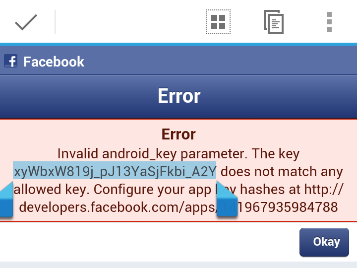

``facebook``: Facebook SDK access
=================================

The ``forge.facebook`` namespace allows access to the [native Facebook SDK](https://developers.facebook.com/docs/sdks/), which provides similar functionality to the [JavaScript SDK](https://developers.facebook.com/docs/reference/javascript/) with the additional feature of supporting SSO (Single Sign-On) between the users Facebook app and your Forge app.

You can see a demo app that makes use of the Facebook module in [this screencast](https://vimeo.com/62372298), with the [code on Github](https://github.com/trigger-corp/scrumptious).

> ::Important:: Using the Facebook module requires you to have a Facebook account and signup to [Facebook's developer platform](https://developers.facebook.com/). Your relationship with Facebook is separate from your relationship with Trigger.io. If you include the Facebook module in your app, the App Id will report information about app installs and usage to Facebook with that information also made available on your dashboard at https://developers.facebook.com. You must disclose to your users that your app passes the App Id to you and Facebook.

##Config options

###Orientations

App ID
:  App ID from Facebook developers site.

> ::Note:: To use this module you will need to setup your app in Facebook. More information can be found in the Tips section below and at [https://developers.facebook.com/](https://developers.facebook.com/)

##API

!method: forge.facebook.authorize([permissions], [audience], success, error)
!param: permissions `array` an optional array of permissions to request ([Facebook SDK Documentation](https://developers.facebook.com/docs/facebook-login/permissions/v2.1#reference))
!param: audience `string` an optional string indicating who should see updates by default (iOS only)
!param: success `function(login_information)` callback to be invoked when no errors occur. `login_information` is in the format: `{ access_token, access_expires, granted, denied }`
!description: Authorize the current user with Facebook. May show a login UI if new permissions are required, or a valid login token is not available (i.e. on first login).
!platforms: iOS, Android
!param: error `function(content)` called with details of any error which may occur

> ::Note:: The success callback will be called with information about the users access\_token, you can store and use this token following the Facebook developer guidelines. 

The ``audience`` parameter is only used on iOS (due to differences in the Facebook SDK), but can be passed in on Android to no ill effect. It should be one of:

- ``everyone``: by default, your app's updates are public
- ``friends``: by default, the user's friends can see your your app's updates
- ``only_me``: by default, just the user can see the updates
- ``none``: no one can see the updates by default

!method: forge.facebook.hasAuthorized([permissions], [audience], success, error)
!param: permissions `array` an optional array of permissions to requst
!param: audience `string` an optional string indicating who should see updates by default (iOS only)
!param: success `function(login_information)` callback to be invoked when no errors occur. `login_information` is in the format: `{ access_token, access_expires, granted, denied }`
!description: Takes the same options and returns the same data as [forge.facebook.authorize](index.html#forgefacebookauthorizepermissions-audience-success-error), but will not prompt the user for login if required. Used to only log in a user if their interaction is not required.
!platforms: iOS, Android
!param: error `function(content)` called with details of any error which may occur

!method: forge.facebook.logout(success, error)
!param: success `function()` callback to be invoked when no errors occur
!description: Logout the current user and clear any cached login details.
!platforms: iOS, Android
!param: error `function(content)` called with details of any error which may occur

!method: forge.facebook.api(path[[, method], params], success, error)
!param: path `string` API path to call, i.e. "me/posts"
!param: method `string` type of request, i.e. "GET"
!param: params `object` additional parameters for the request, e.g. {limit: 5}
!param: success `function(response)` callback to be invoked when no errors occur
!description: Make a Facebook Graph API call. See [https://developers.facebook.com/docs/reference/javascript/FB.api/](https://developers.facebook.com/docs/reference/javascript/FB.api/) for further details.
!platforms: iOS, Android
!param: error `function(content)` called with details of any error which may occur

!method: forge.facebook.ui(params, success, error)
!param: params `object`  dictionary of parameters, must include "method"
!param: success `function(response)` callback to be invoked when no errors occur
!description: Display a Facebook dialog UI. See [https://developers.facebook.com/docs/reference/javascript/FB.ui/](https://developers.facebook.com/docs/reference/javascript/FB.ui/) for further details.
!platforms: iOS, Android
!param: error `function(content)` called with details of any error which may occur

> ::Note:: if the user hits "Cancel" in the dialog, your success callback will still be called - with ``{}`` as its parameter. This is the behaviour of the underlying Facebook SDK - for more information, see [http://stackoverflow.com/a/13729707/29903](http://stackoverflow.com/a/13729707/29903).

!method: forge.facebook.installed(success, error)
!param: success `function(installed)` callback to be invoked when no errors occur
!description: Check if the Facebook App is installed on the device.
!platforms: iOS, Android
!param: error `function(content)` called with details of any error which may occur

!method: forge.facebook.getKeyHash(success, error)
!param: success `function(hashKey)` callback to be invoked when no errors occur
!description: Returns a string representing the Facebook key hash for the application.
!platforms: Android
!param: error `function(err)` called with details of any error which may occur

##Tips

For a quick tutorial on setting up your app in Facebook to enable login and open graph API calls see our [demo app build instructions](https://github.com/trigger-corp/scrumptious#preparing-your-own-version-ready-for-deployment).

###General

-  To use the Facebook module a Facebook app needs to be created on
   [https://developers.facebook.com/apps](https://developers.facebook.com/apps). Additionally, on the app
   configuration page, "Native iOS App" and "Native Android App" need to
   be enabled, and within each of those sections SSO should also be
   enabled.
-  If a user revokes your apps access, or logs out from the Facebook app
   you may get OAuth errors returned from API calls, in this situation
   you should call ``forge.facebook.logout()`` and reauthorize the user.

###Android

-  On Android a hash of the key used to sign your app is required by
   Facebook to confirm your app should be allowed to access the Facebook
   API. One way to obtain this is by using this module's `getHashKey` method, which you can call from Javascript. The other way to configure this is to simply start using the Facebook API, any API methods will return an error message which
   includes the hash and the URL to visit to configure it.

> ::Note:: there is currently a bug in the Facebook app, where the hash displayed in these error messages includes underscores where there should be forward slashes. E.g. if the error message includes the hash `xyWbxW819j_pJ13YaSjFkbi_A2Y`, you should put `xyWbxW819j/pJ13YaSjFkbi/A2Y` as the key hash in the Android settings for your Facebook app.

###iOS

-  On iOS you must add your applications bundle id to the Facebook
   developer app settings page. You set a specific bundle id using the
   ``package_names`` module.
